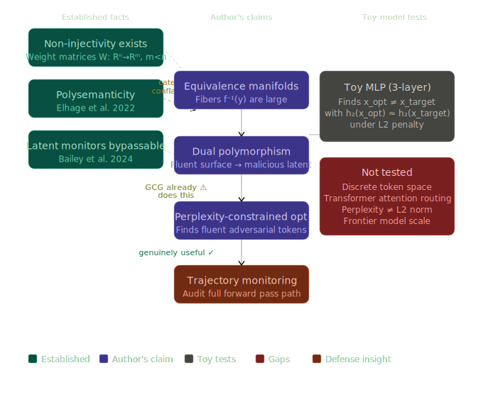

# Dual Polymorphism: A Conceptual Model for Latent-Space Jailbreaks

**Author:** Maximilian Machedon ([@MaxTranced](https://github.com/MaxTranced))

🚨 **FULL AI-ASSISTANCE DISCLAIMER** 🚨
> I am a software engineer, not a formal AI alignment researcher. To bridge the gap between my intuitions and the formal mechanistic interpretability literature, **I heavily utilized AI for all contents in this repository.**
> This includes brainstorming, conceptual red-teaming, drafting, HTML/CSS formatting, and coding. Models used include various versions and architectures of Gemini, Claude (Opus/Sonnet via Claude Code), and GPT. The core causal intuitions, structural arguments, and the decision to synthesize these specific papers are mine, but the execution is deeply AI-co-authored.
>
> *Note: A draft of this write-up was originally submitted to LessWrong but was rejected due to their strict policies against AI-assisted writing. I am hosting it here to establish provenance, maintain full transparency about my workflow, and share the hypothesis directly with the open-source research community. The rejected draft can be viewed [here](https://www.lesswrong.com/posts/pEz53crhDJoWQ2Raq/a-model-for-algorithmic-jailbreaks-dual-polymorphic-shapes).*

---

## Overview

Current LLM guardrails—both surface-level semantic filters and newer latent-space activation monitors—assume a relatively faithful correspondence between an input's semantic intent and its internal computational trajectory. 

This repository outlines a theoretical exploit model that breaks this assumption via **Latent Space Non-Injectivity**. Because the forward pass of a transformer is a non-injective function, many different inputs can produce the same internal representation at any given layer. 

I propose that an adversary could craft a "dual-polymorphic" prompt:
1. **Surface Polymorphism:** The input looks like benign, fluent text (satisfying a perplexity constraint).
2. **Latent Polymorphism:** The input collapses into the exact geometric "shape" of a malicious algorithmic payload at an intermediate hidden layer.

### Argument Map & Epistemic Limits

The following diagram maps the logical structure of this hypothesis, explicitly highlighting the established facts, the proposed synthesis, and the current testing gaps (such as the discrete token barrier and attention routing).

If this hypothesis scales to frontier models, it implies that single-layer activation probing is fundamentally insufficient for alignment. The primary defensive prescription must be **Activation-Trajectory Monitoring**—auditing the full topological path of the forward pass.

## Repository Contents

* [**`Read the Full Essay Here`**](./index.html): The full, formatted essay detailing the causal model, the synthesis of existing literature (GCG, Anthropic's superposition work, Bailey et al. 2024), and an enumeration of the strongest counterarguments. 
* [**`lsn_proof.py`**](./lsn_proof.py): A toy PyTorch MLP demonstrating the "Constraint Compatibility" of this attack. It proves that an optimizer can force a distinct input vector to match a target's activation at a probe layer while satisfying a soft L2 penalty (a continuous proxy for a perplexity constraint). *Note: This toy relies on an architectural bottleneck to force non-injectivity, not true polysemanticity. It is included as an interactive visualization of the math, not an empirical proof of 70B LLM behavior.*

## Request for Research

This is a hypothesis and a conceptual synthesis, not an empirical finding on a frontier model. I do not have the compute to test whether continuous optimization can successfully cross the discrete token barrier on an 80-layer Transformer to target a specific equivalence fiber. 

If anyone in the mechanistic interpretability or adversarial ML space finds this framing useful, the torch is yours. You are completely free to pick this up, test it, and build on it. (A mention by name is always appreciated!)
